# AG PolarTech - Página Web Corporativa

## Descripción del Proyecto

Este proyecto consiste en la creación de una página web profesional para **AG PolarTech**, una empresa dedicada a ofrecer soluciones de climatización (HVAC) que integran tecnología, eficiencia energética y confort ambiental.  
La web tiene como propósito presentar nuestros servicios, productos, trayectoria y valores como compañía.

## Objetivos

- Dar visibilidad digital a la empresa AG PolarTech.
- Brindar información clara y ordenada sobre nuestros **productos** y **servicios HVAC**.
- Fortalecer la imagen profesional de la empresa.
- Facilitar el contacto con posibles clientes.

## Tecnologías Utilizadas

- **HTML5**
- **CSS3**
- **Bootstrap 5.3.5**
- **Bootstrap Icons**
- **JavaScript (uso mínimo, habilitado en navegador)**
- Imágenes y estilos personalizados (favicon, logotipo, etc.)

## Estructura del Sitio

### Página Principal (`index.html`)

- Carrusel de bienvenida con mensajes inspiradores.
- Presentación del fundador.
- Acceso directo a servicios y productos destacados.

### La Empresa (`/html/00_laEmpresa.html`)

- Visión, misión y valores de AG PolarTech.
- Experiencia del equipo y compromiso con el cliente.

### Servicios (`/html/01_servicios.html`)

Ofrecemos:

- Instalación de sistemas HVAC
- Mantenimiento preventivo y correctivo
- Reparaciones especializadas
- Diseño personalizado
- Asesoría técnica
- Soluciones de ventilación

### Productos (`/html/02_productos.html` y subsecciones)

- Mini Split
- Refrigerante Variable
- Equipos Split
- Torres de Enfriamiento
- Equipos tipo Paquete
- Ventilación Mecánica
- Equipos de Precisión
- Equipos Chiller

### Nuestra Trayectoria

- Más de 15 años de experiencia
- 578 casos exitosos
- 244 clientes satisfechos
- 89 desarrollos completados

### Contáctenos

Formulario interactivo para solicitar más información o agendar una asesoría.

### Imagenes de FIGMA

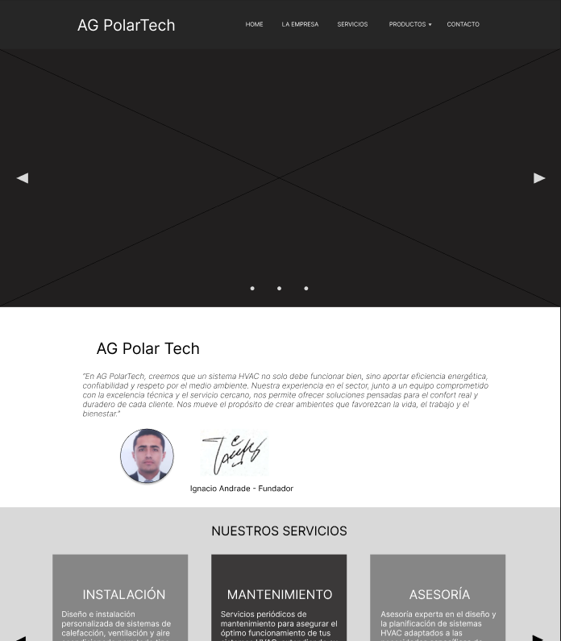
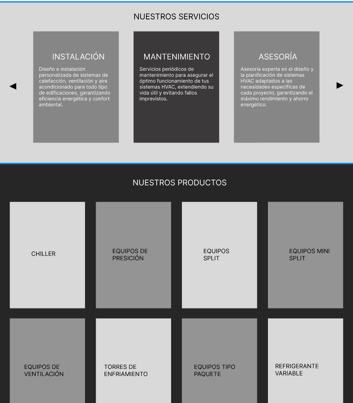
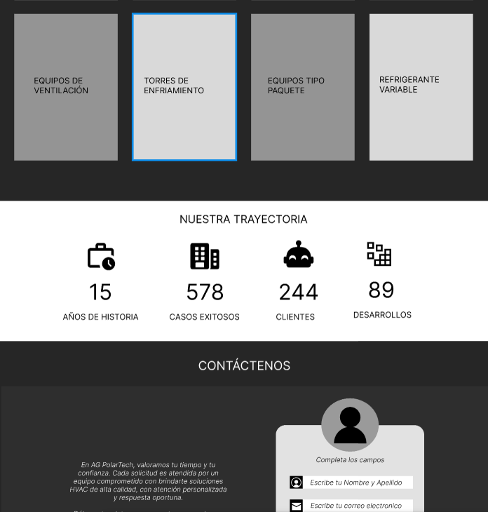
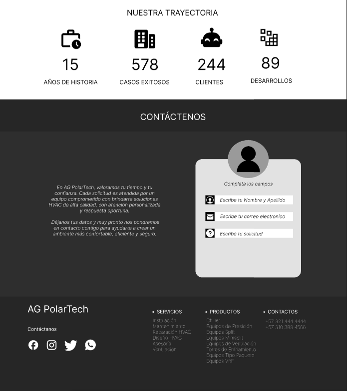
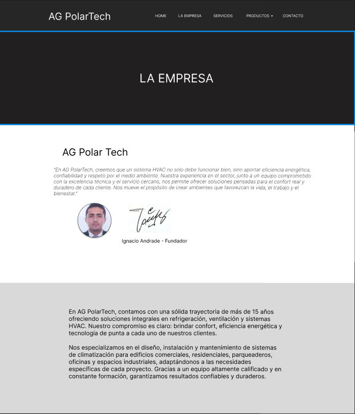
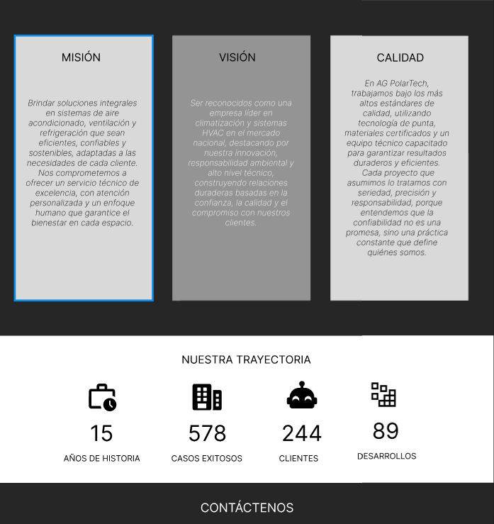
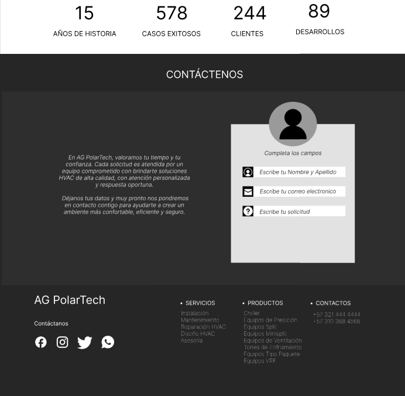
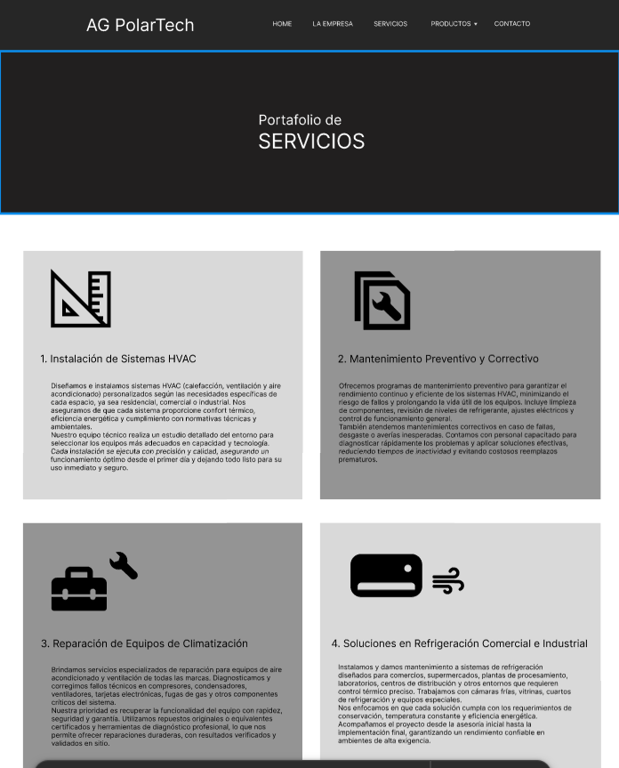
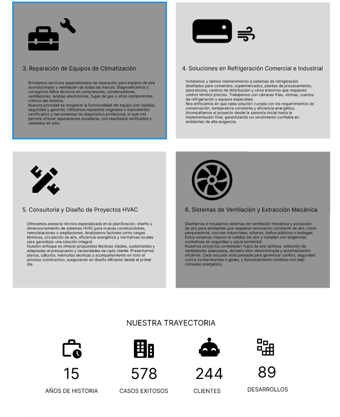
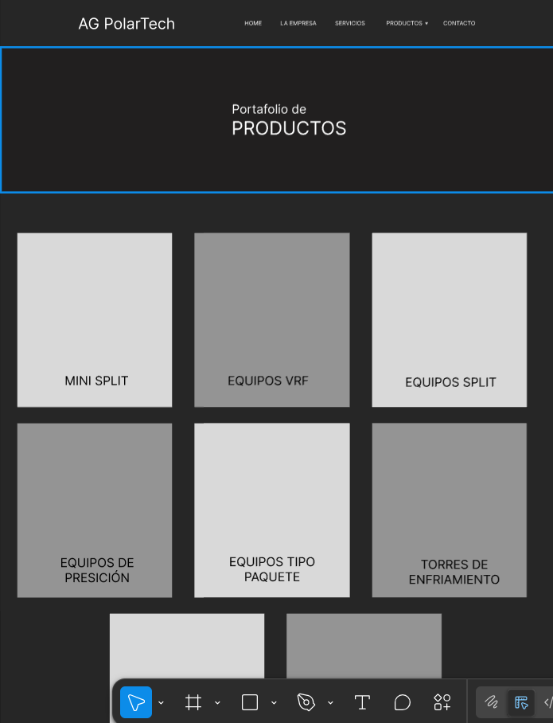
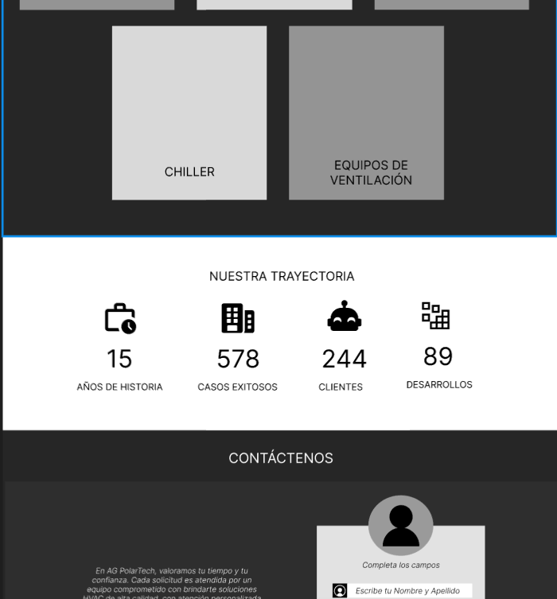
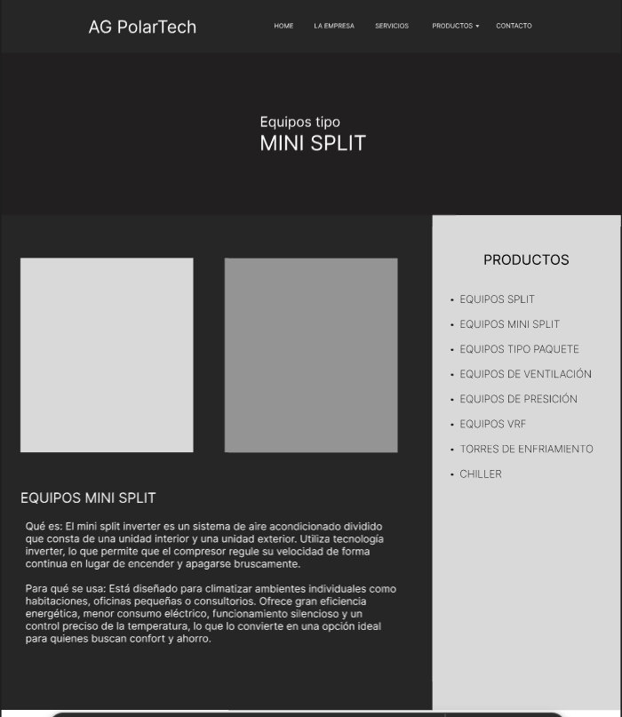
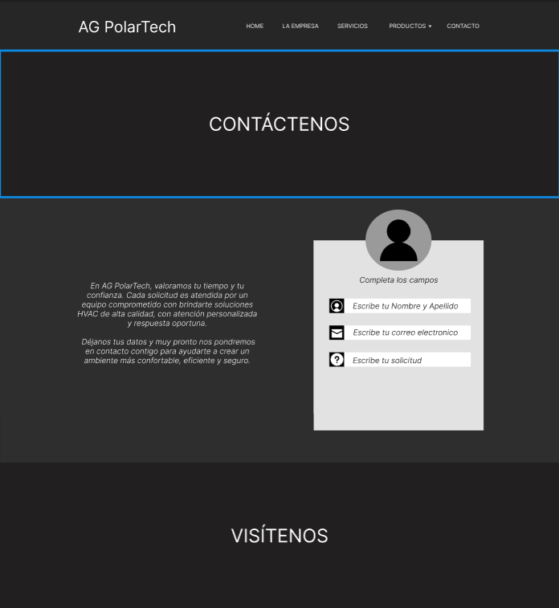

## Autor

**José Ignacio Andrade Gutiérrez**  
Fundador y desarrollador del sitio web de AG PolarTech.

**Fecha de creación del proyecto**: Mayo 2025
